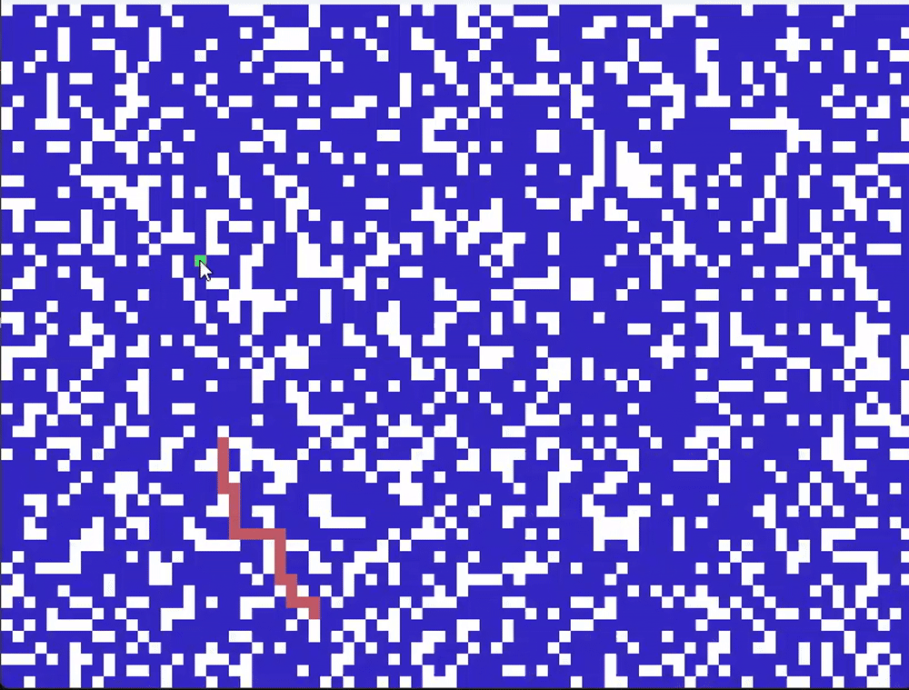

# Pathfinding Visualizer

Et lite visualiseringsprosjekt for graf- og pathfinding-algoritmer.

Programmet genererer en tilfeldig grid-basert graf der enkelte noder mangler og fungerer som hindringer. Brukeren kan deretter visualisere søk og korteste vei mellom startnoden og en valgt node.

## Funksjoner

- Tilfeldig generert graf
- DFS-visualisering
- Dijkstra shortest path
- Interaktiv nodevalg med mus
- Egen graf- og nodeimplementasjon

## Teknologier

- Python
- Pygame
- Grafalgoritmer
- Datastrukturer

- 
